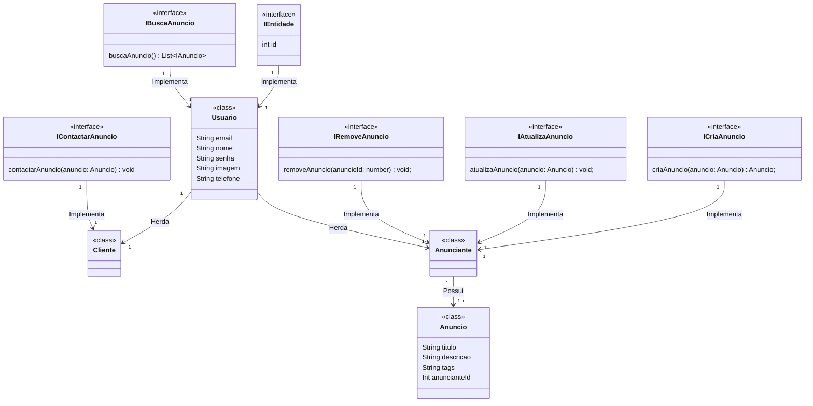

# Diagrama de Classe

Abaixo, o diagrama de classe do projeto.

```mermaid
classDiagram

class IEntidade {
  <<interface>>
  int id
}

IEntidade "1" --> "1" Usuario : Implementa

class IBuscaAnuncio {
  <<interface>>
  buscaAnuncio() List~IAnuncio~
}

class ICriaAnuncio {
  <<interface>>
  criaAnuncio(anuncio: Anuncio) Anuncio;
}

class IAtualizaAnuncio {
  <<interface>>
  atualizaAnuncio(anuncio: Anuncio) void;
}

class IRemoveAnuncio {
  <<interface>>
  removeAnuncio(anuncioId: number) void;
}

class IContactarAnuncio {
  <<interface>>
  contactarAnuncio(anuncio: Anuncio) void
}

IBuscaAnuncio "1" --> "1" Usuario : Implementa

class Usuario {
  <<class>>
  String email
  String nome
  String senha
  String imagem
  String telefone
}

Usuario "1" --> "1" Cliente : Herda
IContactarAnuncio "1" --> "1" Cliente : Implementa

class Cliente {
  <<class>>
}

ICriaAnuncio "1" --> "1" Anunciante : Implementa
IAtualizaAnuncio "1" --> "1" Anunciante : Implementa
IRemoveAnuncio "1" --> "1" Anunciante : Implementa
Usuario "1" --> "1" Anunciante : Herda

class Anunciante {
  <<class>>
}

Anunciante "1" --> "1..n" Anuncio : Possui

class Anuncio {
  <<class>>
  String titulo
  String descricao
  String tags
  Int anuncianteId
}
```
